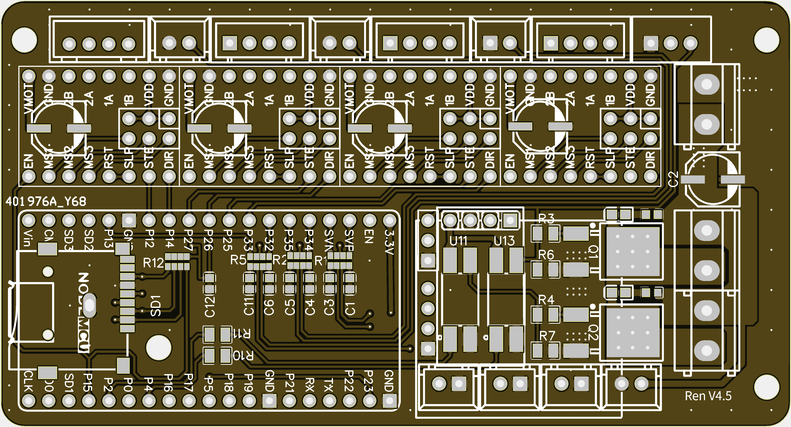
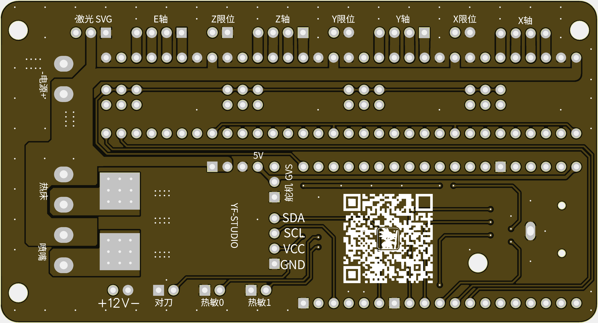
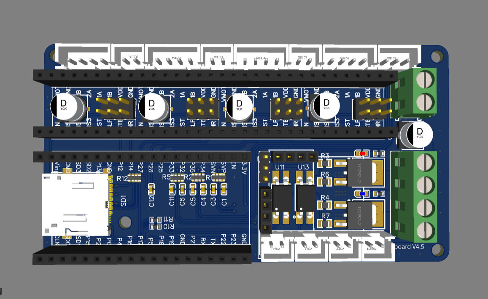

# Yboard
4轴CNC主板，3D打印主板，支持Grbl和Marlin。

## 特色
- 支持WIFI和Bluetooth远程控制
- 内置WebUI上位机，可以不用安装上位机软件
- 支持SD卡脱机，最大可支持32GB SD卡（TF卡）
- 采用层叠技术，全模块化设计，可以很方便的替换损坏的模块
- 硬件资源丰富，32位RISC主板,主频高达240M，内存520KB，4M闪存，秒杀Arduino系列
- 开源，方便按自己的需求修改源码

## 预览
  

## 硬件及软件授权
本仓库所有软件和硬件在GPL v3+下授权，如果您修改了其中任何一部分，请提供修改后的源码。本产品软件及硬件开源，只限于研究使用，不得用于商用。商用请付费获得授权，否则将追究责任。
